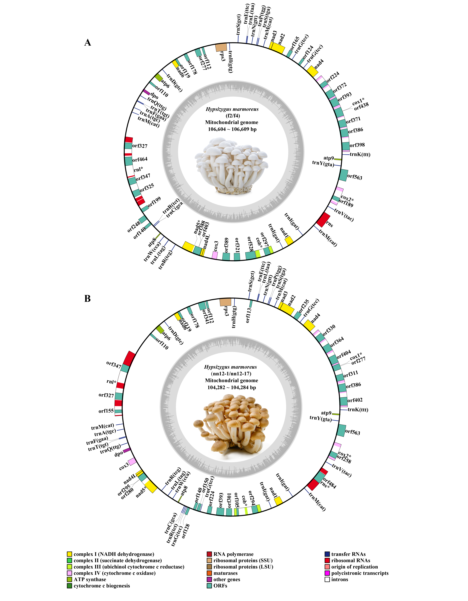

# Figure 1: Mitochondrial genome map of *H. marmoreus*

## Description

Circular mitochondrial genome maps of white (*A*: strain f2) and brown (*B*: strain nn12-1) *Hypsizygus marmoreus*. Genes displayed outside the circle are transcribed clockwise; those inside are transcribed counterclockwise. GC content is shown on the inner circle.

## Tools Used

- **OGDRAW v1.3.1** — Circular genome map visualization
- **Geneious v2025.0.2** — Manual annotation correction

## Methods

The mitochondrial genome was annotated using MFannot and Mitos, then manually corrected in Geneious. The circular map was generated using OGDRAW (https://chlorobox.mpimp-golm.mpg.de/OGDraw.html).

