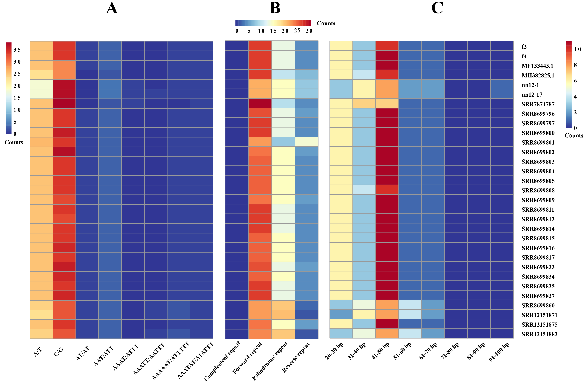

# Figure 2: tRNA secondary structure prediction

## Description

Secondary structures of 20 amino acid tRNAs encoded by the mitochondrial genome of *H. marmoreus*. Red, blue, green, and yellow spheres represent A, U, G, and C bases, respectively.

## Tools Used

- **tRNAscan-SE v2.0.12** — tRNA gene prediction
- **RNAplot v2.7.0** — Preliminary structure prediction
- **Python (matplotlib)** — Final visualization

## Methods

tRNA genes were predicted using tRNAscan-SE with default parameters. Secondary structures were generated using RNAplot from the ViennaRNA package, then visualized using a custom Python script.

