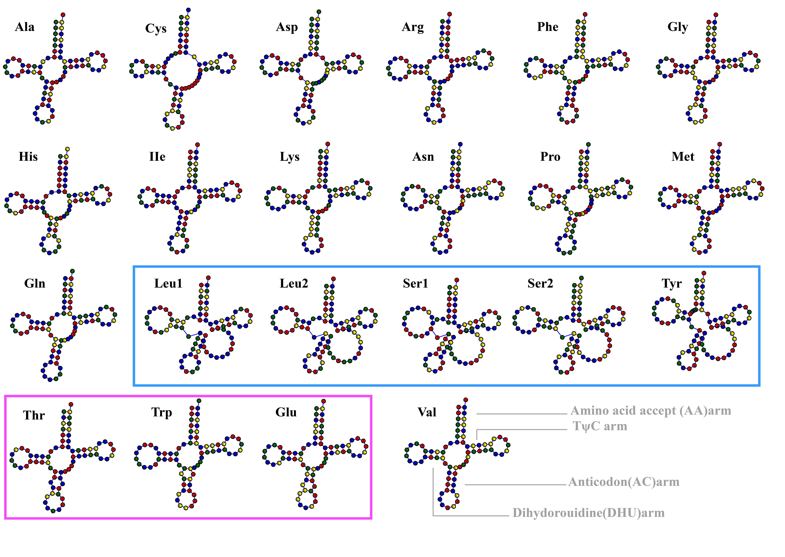

# Figure 3: Repetitive sequence heatmap

## Description

Heatmap of annotated repetitive sequences in the mitochondrial genomes of 31 *H. marmoreus* strains:
- **(A)** Eight SSR motifs detected using MISA
- **(B)** Interspersed repeats (Forward, Palindromic, Reverse, Complementary) detected using REPuter
- **(C)** Long tandem repeat sequences (20–100 bp) detected using TRF

## Tools Used

- **MISA** — Microsatellite (SSR) identification
- **REPuter** — Interspersed repeat detection
- **TRF** — Tandem Repeat Finder
- **R (ggplot2, pheatmap)** — Heatmap visualization

## Methods

SSR loci were identified using MISA with minimum repeat occurrences of 10, 6, 5, 5, 5, and 5 for 1–6 nt units, respectively. Interspersed repeats (F, P, R, C) were detected using REPuter (minimum size = 30 bp, edit distance = 0). Long tandem repeats were identified using TRF with default parameters.

