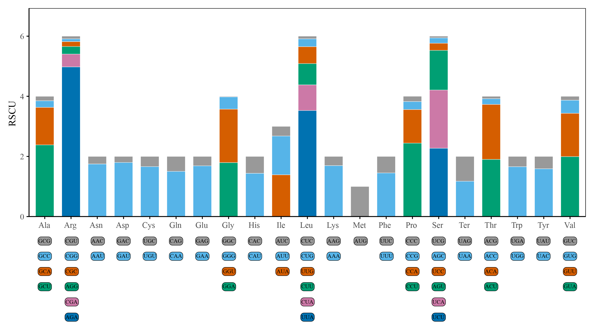

# Figure 4: Relative Synonymous Codon Usage (RSCU) analysis

## Description

RSCU analysis of 15 conserved protein-coding genes (PCGs) in the mitochondrial genome of *H. marmoreus*. RSCU > 1 indicates preferred codons; RSCU < 1 indicates less frequently used codons.

## Scripts

| Script | Description |
|--------|-------------|
| `mimazi.test1.R` | R script for RSCU bar plot visualization |

## Tools Used

- **PhyloSuite v1.2.3** — PCG sequence extraction
- **MEGA v11** — RSCU calculation
- **R (ggplot2)** — Visualization

