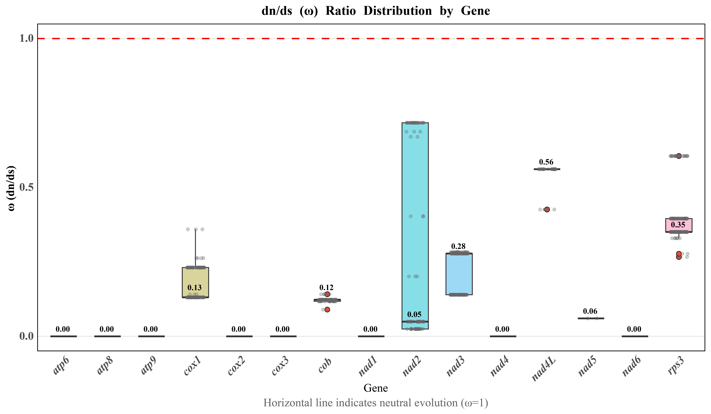

# Figure 5: Ka/Ks selective pressure analysis

## Description

Non-synonymous (Ka) to synonymous (Ks) substitution ratio analysis of 15 core protein-coding genes in the mitochondrial genomes of 31 *H. marmoreus* strains. All genes show ω < 1, indicating purifying selection.

## Scripts

| Script | Description |
|--------|-------------|
| `kaks_15gene.R` | Box plot of ω values for 15 genes (version 1) |
| `KAKS_xiangxiantu.R` | Box plot with NPG color scheme (version 2) |
| `plot_dnds_ggplot.R` | Combined violin/bar/lancet plots |

## Tools Used

- **MAFFT v7.526** — Multiple sequence alignment
- **pamlX v1.3.1** — Ka/Ks calculation
- **R (ggplot2, ggsci)** — Visualization

