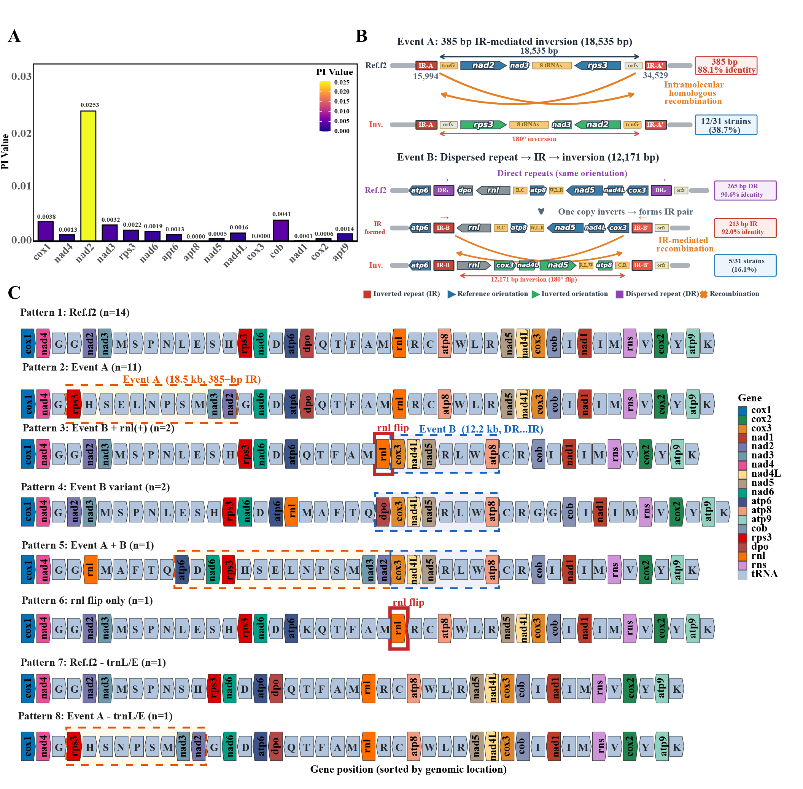

# Figure 6: Nucleotide diversity and gene rearrangement patterns

## Description

- **(A)** Nucleotide polymorphism (π) analysis at the PCG gene level (window length 100 bp, step size 25 bp)
- **(B)** Gene rearrangement patterns across 31 *H. marmoreus* strains, showing two major inversion events

## Scripts

| Script | Description |
|--------|-------------|
| `gene_pi_plot_english.R` | π value bar plot for 15 protein-coding genes |
| `geneorder.duose.R` | Multi-colored gene arrangement diagram across strains |

## Tools Used

- **MAFFT v7.505** — Multiple sequence alignment
- **DnaSP v6** — SNP detection and π calculation
- **R (ggplot2)** — Visualization

