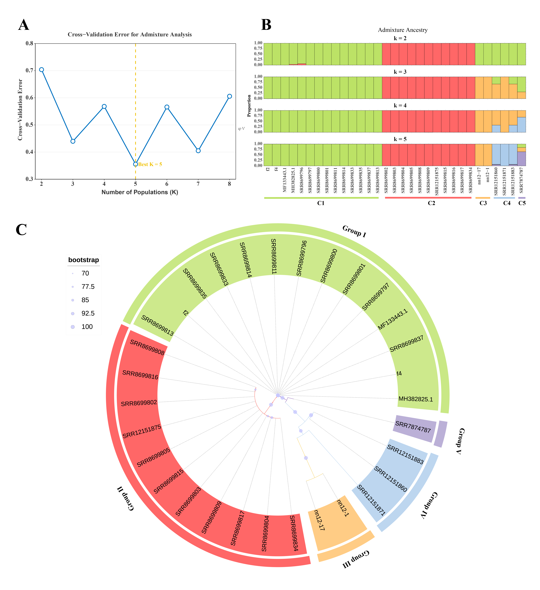

# Figure 7: Phylogenetic and population structure analysis

## Description

- **(A)** Cross-validation error from ADMIXTURE analysis (K=2 to 8)
- **(B)** Population structure bar plots at K=2 to K=5
- **(C)** Maximum-likelihood phylogenetic tree based on 15 concatenated mitochondrial genes
- Additional: 3D PCA visualization

## Scripts

| Script | Description |
|--------|-------------|
| `build_phylogeny.py` | Complete pipeline: gene extraction → MAFFT alignment → concatenation → IQ-TREE |
| `plot_tree.py` | Phylogenetic tree visualization with publication styling |
| `admixture.R` | ADMIXTURE bar plot (version 1, viridis palette) |
| `admixture.2.R` | ADMIXTURE bar plot (version 2, with borders) |
| `admixture.3.R` | ADMIXTURE bar plot (version 3, population-sorted) |
| `CVerror.R` | Cross-validation error line plot |
| `PCA3D.R` | 3D PCA scatter plot using plotly/rgl |

## Tools Used

- **SNP-sites v2.5.1** — SNV extraction
- **ADMIXTURE v1.3.0** — Population structure analysis
- **IQ-TREE v2.0.7** — Maximum-likelihood phylogenetic tree (ModelFinder + 1000 UFBoot)
- **MAFFT v7.526** — Sequence alignment
- **R (ggplot2, ggh4x, plotly)** — Visualization
- **Python (BioPython, matplotlib)** — Tree building pipeline

