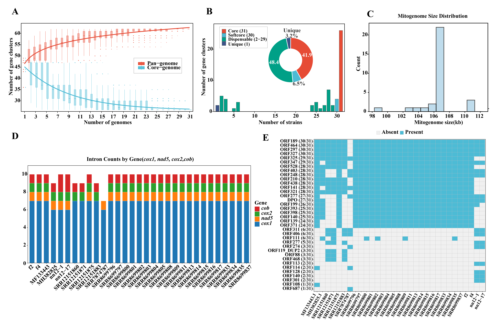

# Figure 8: Mitochondrial pan-genome and intron analysis

## Description

- **(A)** Pan-genome growth curve (power-law fit: y = 46.48 × x^0.087)
- **(B)** Distribution of gene families: core genes vs. shell genes (pie chart)
- **(C)** Per-strain core/shell gene composition (stacked bar chart)
- **(D)** Intron presence/absence heatmap across 31 strains
- **(E)** Gene structure diagrams showing exon/intron/ORF architecture (focus on cox1)
- **(F)** Genome-wide intron distribution map
- **(G)** Intron ORF orthologous group analysis

## Scripts

| Script | Description |
|--------|-------------|
| `pangenome.quxian.py` | Pan-genome accumulation curve |
| `pangenome.quxian+wuchabang.py` | Pan-genome curve with error bars |
| `pangenome.bingtu.py` | Core vs. shell gene pie chart |
| `pangenome.yanbenzhuzhuangtu.py` | Per-strain gene composition bar chart |
| `cunzaiqueshiretu.py` | Gene presence/absence heatmap |
| `neihanzi.zhuzhuangtu.py` | Intron count bar chart |
| `neihanzi.duidiezhuzhuangtu.py` | Stacked intron bar chart by gene |
| `COX1.R` | cox1 gene exon/intron/ORF structure diagram |
| `plotD_intron_heatmap.R` | Intron presence/absence heatmap |
| `plotE_gene_structure.R` | Gene structure visualization |
| `plotF_intron_genome.R` | Genome-wide intron distribution |
| `plotG_intron_orf_pangenome.R` | Intron ORF orthologous group analysis |

## Tools Used

- **OrthoFinder v2.55** — Gene family clustering
- **BioPython** — GenBank file parsing and gene extraction
- **R (ggplot2, gggenes, pheatmap)** — Visualization
- **Python (matplotlib, seaborn)** — Visualization

